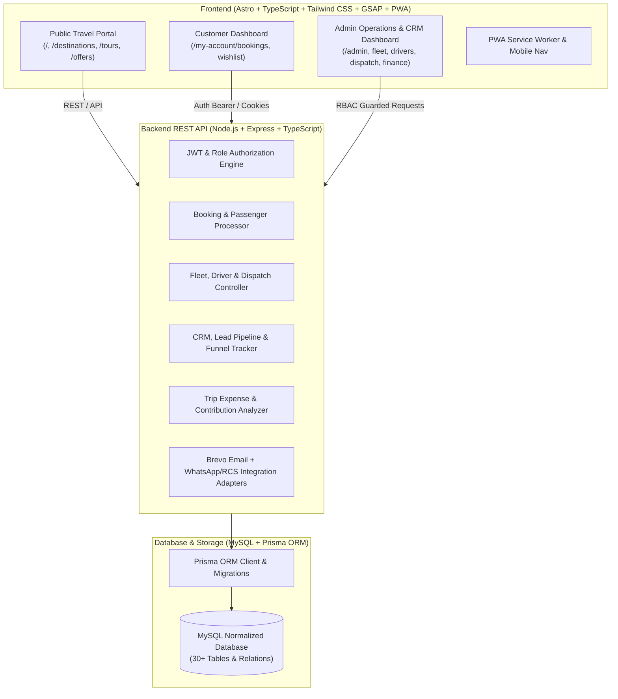

# SHREE CHOWDESHWARI TOURS AND TRAVELS
### Premium Commercial Tours & Travels Web Application & Operations Platform

> **Official Brand**: SHREE CHOWDESHWARI TOURS AND TRAVELS  
> **Tagline**: *"Your Journey. Our Priority."*  
> **Visual Identity**: Deep Navy (`#0A1128`), Luxury Champagne Gold (`#D4AF37`), Crisp White, and Warm Linen Canvas (`#F8F9FA`). Traditional Indian Trust meets Modern Travel Technology and Editorial Luxury.

---

## 🏛️ Executive Summary & Product Architecture

This is a production-grade, independent travel technology platform built exclusively for **Shree Chowdeshwari Tours and Travels**. It integrates a high-converting public travel marketing portal, customer booking engine, interactive itinerary explorer, CRM & lead pipeline, fleet & driver dispatch board, vehicle maintenance & fuel tracker, trip expense & profitability calculator, Brevo transactional email engine, and WhatsApp/RCS communication interfaces.



---

## 📦 Technology Stack

| Layer | Technology | Rationale |
| :--- | :--- | :--- |
| **Frontend Framework** | **Astro 5 + TypeScript** | Zero-JS default for blazing fast Core Web Vitals, SSG/SSR hybrid capabilities, SEO optimization. |
| **Styling & Design System** | **Tailwind CSS + Custom Luxury Tokens** | Deep Navy `#0A1128`, Royal Gold `#D4AF37`, Editorial serif typography (`Playfair Display`, `Cormorant Garamond`, `Plus Jakarta Sans`). |
| **Animations & Motion** | **GSAP + CSS 3D Transforms** | Lightweight high-performance scroll triggers, parallax reveals, and 3D visual depth without heavy 3D engines. |
| **Mobile Experience** | **PWA + Native Bottom Nav** | Web app manifest, touch-friendly UI, offline static asset caching. |
| **Backend API** | **Node.js + Express.js (TypeScript)** | Modular REST API, structured controllers, secure middleware, strict typing. |
| **Database & ORM** | **MySQL + Prisma ORM** | Normalized relational data model, transaction support, foreign keys, and performant indexes. |
| **Authentication** | **Argon2 / Bcrypt Password Hashing + JWT / HttpOnly Cookies** | Role-based authorization (`SUPER_ADMIN`, `ADMIN`, `OPERATIONS_MANAGER`, `FLEET_MANAGER`, `SALES_AGENT`, `DRIVER`, `CUSTOMER`). |
| **Communications** | **Brevo (Sendinblue) API + WhatsApp Business API Ready** | Transactional booking confirmations, quotes, reset links, driver trip assignments. |
| **Hosting Target** | **Hostinger Managed Node.js / Web Hosting** | Lightweight, single-process execution, production-optimized builds. |

---

## 🚀 Key Modules & Capabilities

1. **Public Marketing Portal**:
   - Cinematic Homepage with animated Hero, Live Search console (*Destination, Date, Travellers, Tour Type*).
   - Dynamic Destination Guides (*Kashmir, Kerala, Coorg, Goa, Rajasthan, Himachal, Andaman, Dubai, Bali, Singapore*).
   - Tour Package Discovery with Day-by-day Itineraries, Inclusions, Exclusions, Gallery & Pricing.
   - Interactive Trip Planner (*Custom Bespoke Itinerary Architect*).
   - SEO Engine with JSON-LD Structured Data, OpenGraph, Canonical URLs, and auto-generated XML Sitemaps.

2. **Customer Portal ("My Account")**:
   - Real-time booking tracking (`SCT-2026-000001`), digital trip vouchers, passenger management, wishlist, and direct support.

3. **Admin Operations & Fleet SaaS**:
   - **Lead & CRM Management**: 7-stage Kanban pipeline (*New, Contacted, Qualified, Quotation, Negotiation, Won, Lost*).
   - **Driver Management**: Profiles, licensing, expiry alert badges, active status (*Available, On Trip, On Leave*).
   - **Fleet Management**: Sedans, SUVs, Tempo Travellers, Luxury Coaches with document tracking (PUC, Fitness, Insurance).
   - **Trip Dispatch Board**: Real-time operational daily schedule matching bookings, vehicles, and chauffeurs.
   - **Vehicle Maintenance & Service History**: Service logs, parts replacement records, odometer trackers, maintenance cost analysis.
   - **Fuel & Expense Tracking**: Litres, fuel economy estimates, toll/parking/driver allowances.
   - **Trip Profitability Analyzer**: Operational revenue vs expenses contribution margin calculator.
   - **Marketing & Campaign Attribution**: UTM tracking, funnel conversion analytics (*Landing Page → Enquiry → Booking → Confirmation*).

---

## 🔒 Security Architecture
- Robust password hashing (Bcrypt with salt rounds).
- Strict RBAC middleware guarding administrative routes.
- SQL injection prevention via Prisma parameterized queries.
- XSS and CSRF protection headers.
- Audit logging for all critical business actions.

---

## 📁 Repository Structure

```text
shree-chowdeshwari-travels/
├── backend/                  # Node.js + Express + TypeScript API
│   ├── src/
│   │   ├── config/           # Database, Brevo, WhatsApp, Razorpay configs
│   │   ├── controllers/      # REST endpoint controllers
│   │   ├── middleware/       # Auth, RBAC, Validation, Error Handling
│   │   ├── routes/           # Express Route definitions
│   │   ├── services/         # Email, notifications, calculations
│   │   └── index.ts          # Server entry point
│   ├── package.json
│   └── tsconfig.json
├── frontend/                 # Astro + TypeScript + Tailwind CSS
│   ├── public/               # Manifest, icons, static assets
│   ├── src/
│   │   ├── components/       # Reusable UI, Hero, Search, Tours, Admin widgets
│   │   ├── layouts/          # BaseLayout, AdminLayout, CustomerLayout
│   │   ├── pages/            # Public, Customer & Admin page routes
│   │   └── styles/           # Tailwind & Custom Luxury Tokens
│   ├── astro.config.mjs
│   ├── package.json
│   └── tsconfig.json
├── prisma/
│   ├── schema.prisma         # Complete normalized 30+ table database schema
│   └── seed.ts               # Realistic production demo seed dataset
├── shared/
│   └── types/                # Shared TypeScript models and interfaces
├── .env.example              # Environment variables template
├── ARCHITECTURE.md           # Detailed technical architecture specification
└── README.md
```

---
*Built with precision for Shree Chowdeshwari Tours and Travels.*
